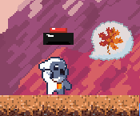

# Season Break - A Charming Platformer Game

Welcome to Season Break, an adorable platformer game created for the FCAI-CU GameJam, where you embark on a thrilling adventure as a cute monster! Your goal is to guide our lovable protagonist through 5 levels filled with captivating challenges and magical surprises. Change the seasons to modify the landscapes and navigate through various obstacles.

## Skills Learned

During the development of Season Break, I had the opportunity to strengthen my programming skills in C#. I implemented essential concepts such as using singletons for efficient data management and leveraged C# Events for seamless communication between game elements. Additionally, I designed a reliable Scene Loader Class to ensure smooth level transitions. Moreover, I dabbled in UI design, creating attractive main menus and engaging settings interfaces.

## Contributions and Acknowledgments

I want to express my gratitude to the following individuals for their invaluable contributions to the project:

- [Mahmoud Adel](https://github.com/DarkenSoda)
- [Yassin Tarek Helmy](https://github.com/YassinTarekHelmy)
- [Abdelrahman Adel](https://github.com/TheOnlyMonster)

Your support and feedback significantly improved the quality of Season Break!

## Download

🔗 [Download Season Break Here](https://darkensoda.itch.io/season-break)

## Gameplay Instructions

- Use the arrow keys to move the cute monster.
- Press the spacebar to jump and avoid obstacles.
- Press the "Season Change" key (customizable in settings) to alter the environment and overcome challenges.

## Installation and Usage

1. Download the game using the link above.
2. Extract the downloaded zip file.
3. Run "SeasonBreak.exe" to start playing.
4. Have fun exploring the charming world of Season Break!

## Contribution

If you want to contribute to Season Break, feel free to fork this repository and submit a pull request. Your contributions are highly appreciated!

## Bug Reporting

Found a bug or facing an issue? Please create a new issue [here](https://github.com/DarkenSoda/Season-Break/issues) and let me know. I'll do my best to fix it.

## Feedback

Your feedback is essential for enhancing Season Break. Please share your thoughts, suggestions, or any improvements you'd like to see in the game [here](https://github.com/DarkenSoda/Season-Break).

## License

Season Break is released under the [MIT License](LICENSE).

Enjoy the game and happy gaming! 🎮✨
